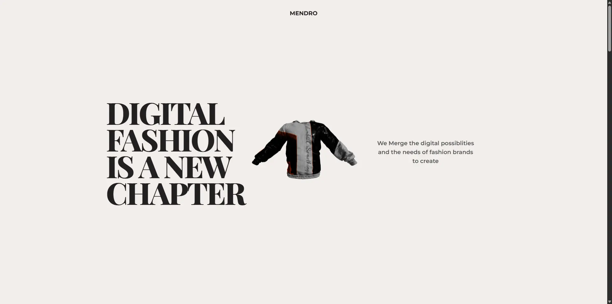

# 🌐 Landing Page Animada con React, GSAP y Three.js

Una landing page interactiva desarrollada para explorar la integración de **animaciones avanzadas**, **renderizado 3D** y **diseño responsive moderno** utilizando React y herramientas del ecosistema frontend actual.

---

## 🚀 Objetivo del proyecto

El propósito principal fue profundizar en la creación de interfaces modernas combinando animaciones y gráficos 3D en un entorno React, enfocándome en:

* Integración de animaciones complejas usando GSAP dentro del ciclo de vida de React.
* Implementación de escenas 3D en la web mediante Three.js y React Three Fiber.
* Construcción de un diseño responsive utilizando Tailwind CSS.
* Organización y optimización del rendimiento en una landing animada.

---

## 🛠️ Stack Tecnológico

* **React** – Biblioteca para la construcción de interfaces de usuario.
* **Vite** – Herramienta de desarrollo y bundler moderno.
* **Tailwind CSS** – Framework CSS utilitario para diseño responsive.
* **GSAP** – Librería de animaciones de alto rendimiento.
* **Three.js** – Motor gráfico 3D basado en WebGL.
* **React Three Fiber** – Renderer de Three.js para React.
* **Drei** – Utilidades y helpers para React Three Fiber.

---

## 📚 Lo que aprendí

* Cómo integrar correctamente **GSAP con React**, evitando conflictos con el renderizado y el ciclo de vida de componentes.
* Manejo de animaciones sincronizadas con el scroll utilizando ScrollTrigger.
* Integración de contenido 3D dentro de una aplicación React usando React Three Fiber.
* Organización de componentes animados manteniendo escalabilidad y legibilidad del código.
* Creación de layouts responsive modernos con Tailwind CSS.

---

## 🧩 Retos encontrados

* Manejo del estado y el ciclo de vida al combinar animaciones imperativas (GSAP) con React.
* Evitar problemas de rendimiento al mezclar animaciones y renderizado 3D.
* Coordinación entre animaciones de scroll y escenas 3D.

---

## 🔗 Demo

El proyecto está desplegado en **Netlify**:
👉 https://m3ndro.netlify.app

---

## 🖼️ Screenshots

---

## 📌 Próximos pasos

* Mejorar accesibilidad (a11y) en elementos animados.
* Optimizar performance en dispositivos móviles.
* Implementar modo oscuro con Tailwind CSS.
* Añadir transiciones de página más avanzadas.
